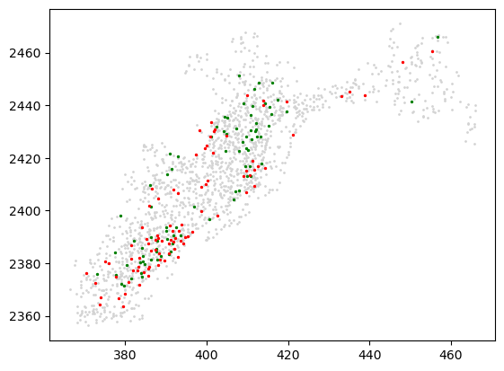

InSTAnT
=======

**InSTAnT** is a toolkit to idetify gene pairs which are d-colocalized
from single molecule measurement data e.g. MERFISH or SeqFISH. A gene
pair is d-colocalized when their transcripts are within distance d
across many cells.

This repository contains implementation of PP Test and CPB test and demo
on a U2OS dataset. The dataset can be downloaded from here (Moffit et
al., 2016, PNAS ) -
https://drive.google.com/drive/folders/1EREibFEkDATLWcWSZmvhxmRhgI6b8ODz

First we’ll load data. We’ll use Replicate 3 for our demo purpose.

.. code:: ipython3

    import data_processing
    from data_processing.data_processing_u2_os_zhuang import DataLoader
    dir_zhuang = '/Users/anurendrakumar/Desktop/Data/Zhuang_u2os/'
    rep = 'rep3'
    data_path = dir_zhuang + rep +  '/data.csv'
    codebook_path = dir_zhuang + 'codebook.csv'
    min_intensity = 10**0.75
    min_area = 3
    print(f'minimum intensity of a spot is {min_intensity} and minimum area of a spot is {min_area}')
    dataset = DataLoader(data_path,codebook_path, min_intensity = min_intensity, min_area = min_area)
    dataset.df.head()

.. parsed-literal::

    minimum intensity of a spot is 5.623413251903491 and minimum area of a spot is 3
    time taken to load data 68.46696591377258

.. raw:: html

    

    
    <table border="1" class="dataframe">
      <thead>
        <tr style="text-align: right;">
          <th></th>
          <th>uID</th>
          <th>inNucleus</th>
          <th>absX</th>
          <th>absY</th>
          <th>distPeriphery</th>
          <th>distNucleus</th>
        </tr>
        <tr>
          <th>geneName</th>
          <th></th>
          <th></th>
          <th></th>
          <th></th>
          <th></th>
          <th></th>
        </tr>
      </thead>
      <tbody>
        <tr>
          <th>Blank-1</th>
          <td>6</td>
          <td>0</td>
          <td>-1457.361</td>
          <td>-2923.475</td>
          <td>3.772213</td>
          <td>6.794436</td>
        </tr>
        <tr>
          <th>Blank-1</th>
          <td>6</td>
          <td>1</td>
          <td>-1465.875</td>
          <td>-2892.676</td>
          <td>12.832250</td>
          <td>1.931445</td>
        </tr>
        <tr>
          <th>Blank-1</th>
          <td>7</td>
          <td>1</td>
          <td>-1468.562</td>
          <td>-3076.986</td>
          <td>12.460330</td>
          <td>2.679462</td>
        </tr>
        <tr>
          <th>Blank-1</th>
          <td>6</td>
          <td>0</td>
          <td>-1480.417</td>
          <td>-2896.956</td>
          <td>8.845369</td>
          <td>5.643676</td>
        </tr>
        <tr>
          <th>Blank-1</th>
          <td>10</td>
          <td>0</td>
          <td>-1519.519</td>
          <td>-2994.717</td>
          <td>7.969208</td>
          <td>5.786599</td>
        </tr>
      </tbody>
    </table>
    

.. code:: ipython3

    cell_id_list = dataset.df.uID.unique()
    num_cells = len(cell_id_list)
    num_genes = len(dataset.df.index.unique())
    print(f'number of cells are {num_cells} and number of genes are {num_genes}')

.. parsed-literal::

    number of cells are 3237 and number of genes are 140

First we will run PP test on one of the cells.

.. code:: ipython3

    import PP
    from PP.proximal_pairs import ProximalPairs
    import pandas as pd
    cell_id= 2500
    print(f'cell id is {cell_id}')
    dist_threshold=4
    cell_df = dataset.df[dataset.df.uID == cell_id].copy()
    pp_model = ProximalPairs(dataset.geneList, cell_df,  dist_thresh = dist_threshold)
    p_val_pp = pp_model.p_vals
    p_val_pp_df = pd.DataFrame(p_val_pp, index=dataset.geneList,columns=dataset.geneList)
    p_val_pp_df.head()

.. parsed-literal::

    cell id is 2500

.. raw:: html

    

    
    <table border="1" class="dataframe">
      <thead>
        <tr style="text-align: right;">
          <th></th>
          <th>Blank-1</th>
          <th>Blank-10</th>
          <th>Blank-2</th>
          <th>Blank-3</th>
          <th>Blank-4</th>
          <th>Blank-5</th>
          <th>Blank-6</th>
          <th>Blank-7</th>
          <th>Blank-8</th>
          <th>Blank-9</th>
          <th>...</th>
          <th>SOD2</th>
          <th>C14orf132</th>
          <th>ZNF592</th>
          <th>CDYL2</th>
          <th>VPS13D</th>
          <th>AGAP1</th>
          <th>XKR5</th>
          <th>FBN2</th>
          <th>RP4-671O14.6</th>
          <th>NHSL2</th>
        </tr>
      </thead>
      <tbody>
        <tr>
          <th>Blank-1</th>
          <td>1.0</td>
          <td>1.0</td>
          <td>1.000000</td>
          <td>1.000000</td>
          <td>1.000000</td>
          <td>1.000000</td>
          <td>0.308330</td>
          <td>1.0</td>
          <td>0.377476</td>
          <td>1.000000</td>
          <td>...</td>
          <td>1.0</td>
          <td>1.0</td>
          <td>1.000000</td>
          <td>1.00000</td>
          <td>1.000000</td>
          <td>0.928151</td>
          <td>0.146143</td>
          <td>1.000000</td>
          <td>1.000000</td>
          <td>1.0</td>
        </tr>
        <tr>
          <th>Blank-10</th>
          <td>1.0</td>
          <td>1.0</td>
          <td>1.000000</td>
          <td>1.000000</td>
          <td>1.000000</td>
          <td>1.000000</td>
          <td>0.217893</td>
          <td>1.0</td>
          <td>1.000000</td>
          <td>1.000000</td>
          <td>...</td>
          <td>1.0</td>
          <td>1.0</td>
          <td>1.000000</td>
          <td>1.00000</td>
          <td>1.000000</td>
          <td>0.252791</td>
          <td>1.000000</td>
          <td>1.000000</td>
          <td>1.000000</td>
          <td>1.0</td>
        </tr>
        <tr>
          <th>Blank-2</th>
          <td>1.0</td>
          <td>1.0</td>
          <td>1.000000</td>
          <td>0.231503</td>
          <td>1.000000</td>
          <td>0.153492</td>
          <td>1.000000</td>
          <td>1.0</td>
          <td>1.000000</td>
          <td>1.000000</td>
          <td>...</td>
          <td>1.0</td>
          <td>1.0</td>
          <td>0.707362</td>
          <td>0.45904</td>
          <td>1.000000</td>
          <td>0.439865</td>
          <td>0.231503</td>
          <td>0.827172</td>
          <td>1.000000</td>
          <td>1.0</td>
        </tr>
        <tr>
          <th>Blank-3</th>
          <td>1.0</td>
          <td>1.0</td>
          <td>0.231503</td>
          <td>1.000000</td>
          <td>1.000000</td>
          <td>0.343813</td>
          <td>1.000000</td>
          <td>1.0</td>
          <td>1.000000</td>
          <td>0.051097</td>
          <td>...</td>
          <td>1.0</td>
          <td>1.0</td>
          <td>0.165752</td>
          <td>1.00000</td>
          <td>0.270928</td>
          <td>0.928151</td>
          <td>1.000000</td>
          <td>0.651206</td>
          <td>0.343813</td>
          <td>1.0</td>
        </tr>
        <tr>
          <th>Blank-4</th>
          <td>1.0</td>
          <td>1.0</td>
          <td>1.000000</td>
          <td>1.000000</td>
          <td>0.146143</td>
          <td>1.000000</td>
          <td>1.000000</td>
          <td>1.0</td>
          <td>1.000000</td>
          <td>1.000000</td>
          <td>...</td>
          <td>1.0</td>
          <td>1.0</td>
          <td>1.000000</td>
          <td>0.30833</td>
          <td>1.000000</td>
          <td>0.737288</td>
          <td>1.000000</td>
          <td>1.000000</td>
          <td>1.000000</td>
          <td>1.0</td>
        </tr>
      </tbody>
    </table>
    
5 rows × 140 columns

    

We can threshold above dataframe to find gene pairs that are proximal
pairs in current cell. Let’s visualize the best gene pair in the cell.

.. code:: ipython3

    import numpy as np
    i,j= np.unravel_index(p_val_pp.argmin(), p_val_pp.shape)
    alpha_pp=1e-3
    if p_val_pp.min()<alpha_pp:
        print(f'A proximal gene pair in cell id {cell_id} is ({dataset.geneList[i]},{dataset.geneList[j]}) with a p-value of {p_val_pp[i,j]}')

.. parsed-literal::

    A proximal gene pair in cell id 2500 is (TLN1,SPTBN1) with a p-value of 2.704786620128239e-25

.. raw:: html

    

    
    <table border="1" class="dataframe">
      <thead>
        <tr style="text-align: right;">
          <th></th>
          <th>uID</th>
          <th>inNucleus</th>
          <th>absX</th>
          <th>absY</th>
          <th>distPeriphery</th>
          <th>distNucleus</th>
        </tr>
        <tr>
          <th>geneName</th>
          <th></th>
          <th></th>
          <th></th>
          <th></th>
          <th></th>
          <th></th>
        </tr>
      </thead>
      <tbody>
        <tr>
          <th>SPTBN1</th>
          <td>2500</td>
          <td>0</td>
          <td>455.4464</td>
          <td>2460.393</td>
          <td>2.979752</td>
          <td>50.46334</td>
        </tr>
        <tr>
          <th>SPTBN1</th>
          <td>2500</td>
          <td>0</td>
          <td>448.1335</td>
          <td>2456.537</td>
          <td>5.048785</td>
          <td>42.29124</td>
        </tr>
        <tr>
          <th>SPTBN1</th>
          <td>2500</td>
          <td>0</td>
          <td>438.8121</td>
          <td>2443.859</td>
          <td>3.564475</td>
          <td>27.55157</td>
        </tr>
        <tr>
          <th>SPTBN1</th>
          <td>2500</td>
          <td>0</td>
          <td>435.1624</td>
          <td>2445.060</td>
          <td>4.225828</td>
          <td>25.04985</td>
        </tr>
        <tr>
          <th>SPTBN1</th>
          <td>2500</td>
          <td>0</td>
          <td>433.0107</td>
          <td>2443.494</td>
          <td>3.199360</td>
          <td>22.38965</td>
        </tr>
        <tr>
          <th>...</th>
          <td>...</td>
          <td>...</td>
          <td>...</td>
          <td>...</td>
          <td>...</td>
          <td>...</td>
        </tr>
        <tr>
          <th>SPTBN1</th>
          <td>2500</td>
          <td>0</td>
          <td>375.0984</td>
          <td>2380.630</td>
          <td>4.509878</td>
          <td>29.67175</td>
        </tr>
        <tr>
          <th>SPTBN1</th>
          <td>2500</td>
          <td>0</td>
          <td>373.9379</td>
          <td>2367.181</td>
          <td>8.172029</td>
          <td>39.69610</td>
        </tr>
        <tr>
          <th>SPTBN1</th>
          <td>2500</td>
          <td>0</td>
          <td>373.8594</td>
          <td>2364.160</td>
          <td>8.508129</td>
          <td>42.06485</td>
        </tr>
        <tr>
          <th>SPTBN1</th>
          <td>2500</td>
          <td>0</td>
          <td>372.6725</td>
          <td>2372.458</td>
          <td>4.588898</td>
          <td>36.77920</td>
        </tr>
        <tr>
          <th>SPTBN1</th>
          <td>2500</td>
          <td>0</td>
          <td>370.4523</td>
          <td>2376.115</td>
          <td>1.984141</td>
          <td>36.09156</td>
        </tr>
      </tbody>
    </table>
    
90 rows × 6 columns

    

We can visualize this pair in current cell.

.. code:: ipython3

    import matplotlib.pyplot as plt
    plt.scatter(cell_df.absX,cell_df.absY,s=1, c='#D3D3D3')
    plt.scatter(cell_df.loc[dataset.geneList[i]].absX,cell_df.loc[dataset.geneList[i]].absY,s=2, c='g')
    plt.scatter(cell_df.loc[dataset.geneList[j]].absX,cell_df.loc[dataset.geneList[j]].absY,s=2, c='r')

.. parsed-literal::

    <matplotlib.collections.PathCollection at 0x7fb20a183ac0>

